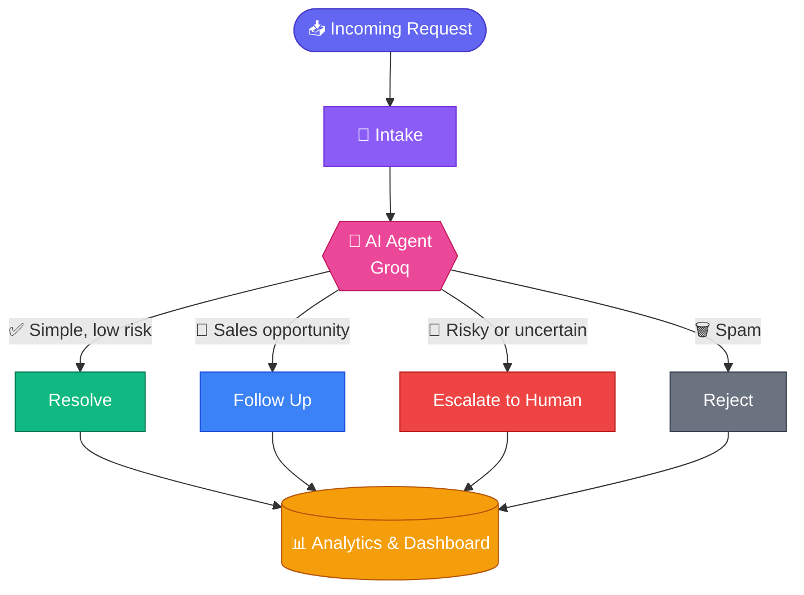

<div align="center">


<a href="https://github.com/Anushkagoel07/AutoOps">
  
</a>

<br/>


### 🤖 **Less manual work. Faster decisions. Smarter operations.**

[🚀 Quick Start](#-getting-started) •
[✨ Features](#-core-features) •
[🎯 Demo](#-demo-scenarios) •
[📊 Dashboard](#-dashboard) •
[🔌 API](#-api-routes)

</div>

---

## 🚀 What is AutoOps?

Businesses receive hundreds of support requests and sales inquiries that need repetitive manual processing.

**AutoOps** is an **AI-powered autonomous operations platform** that does more than generate replies. It understands each incoming request, classifies it, evaluates priority and confidence, and then **decides what should happen next**: resolve, follow up, escalate, or reject.

<table>
<tr>
<td>🧠 Understand requests</td>
<td>🏷️ Classify support & sales intent</td>
<td>⚡ Determine priority</td>
</tr>
<tr>
<td>🎯 Calculate AI confidence</td>
<td>🤝 Decide the next action</td>
<td>💬 Generate responses</td>
</tr>
<tr>
<td>🚨 Escalate risky cases</td>
<td>📈 Track leads & activity</td>
<td>📊 AI-powered analytics</td>
</tr>
</table>

---

## ✨ Core Features

### 🧠 Autonomous AI Agent

Every request is analyzed with structured AI reasoning. The agent produces:

| 🔑 Field | 📝 Description |
| :-- | :-- |
| 🏷️ **Category** | Billing, Technical, Account, General, Spam, Sales Intent |
| ⚡ **Priority** | 🟢 Low · 🟡 Medium · 🟠 High · 🔴 Critical |
| 🎯 **Confidence** | AI confidence score |
| 🤝 **Decision** | Resolve, Follow Up, Escalate, Reject |
| 💡 **Reason** | Explainable reasoning behind the decision |
| ⚙️ **Action** | The action taken by the system |

### ⚡ Intelligent Decisions

| | Decision | What happens |
| :-: | :-- | :-- |
| ✅ | **Auto Resolve** | Handles simple, low-risk support questions |
| 📩 | **Follow Up** | Spots genuine sales opportunities and starts a simulated follow-up |
| 🚨 | **Escalate** | Routes sensitive, uncertain, or high-risk requests to a human |
| 🗑️ | **Reject** | Identifies and archives obvious spam |

---

## 🎯 Demo Scenarios

AutoOps is built around realistic business situations.

| | Scenario | Incoming message | Result |
| :-: | :-- | :-- | :-- |
| 💳 | **Duplicate Billing** | *"My card was charged twice for the same subscription."* | `Billing` → 🟠 `High` → 🚨 **Escalate** |
| 🔐 | **Password Reset** | *"How can I reset my password?"* | `Account` → 🟢 `Low` → ✅ **Auto Resolve** |
| 🏢 | **Enterprise Lead** | *"We are a 50-person company looking for your enterprise plan."* | `Qualified Lead` → 🟠 `High` → 📩 **Follow Up** |
| 🚫 | **Spam** | *"WIN FREE MONEY!!!"* | `Spam` → 🟢 `Low` → 🗑️ **Reject** |

---

## 📊 Dashboard

An operations dashboard for monitoring AI-driven workflows.

**📌 Operations Overview**

- 📥 Total requests
- ⏳ Pending requests
- ✅ Resolved requests
- 🚨 Escalated requests
- 🔴 Live activity feed
- 🥧 Decision distribution
- 🧑‍💼 Human escalation queue

**📈 Analytics**

- 📉 Request trends
- 🍰 Decision breakdown
- 🔍 Operational insights
- 💬 Natural-language analytics

---

## 🧠 Ask Neural Pulse

A natural-language analytics layer powered by **Neural Pulse**. Instead of manually filtering data, just ask:

> 💬 **"How many requests were escalated today?"**
>
> 💬 **"Which category generates the most support requests?"**

The analytics layer turns operational data into useful insights.

---

## 🔄 How AutoOps Works



---

## 🛠️ Tech Stack

<table>
<tr>
<td valign="top" width="25%">

### 🎨 Frontend
- **Next.js**
- **React**
- **TypeScript**
- **Tailwind CSS**
- **Recharts**

</td>
<td valign="top" width="25%">

### 🤖 AI
- **Groq**
- Function calling
- Structured AI output

</td>
<td valign="top" width="25%">

### 📊 Data & Analytics
- **Neural Pulse**
- Local JSON storage (demo fallback)

</td>
<td valign="top" width="25%">

### ☁️ Deployment
- **Vercel**

</td>
</tr>
</table>

---

## 📂 Project Structure

```text
AutoOps/
│
├── 📁 app/
│   ├── 📁 api/
│   │   ├── actions/
│   │   ├── agent/
│   │   ├── analytics/
│   │   └── requests/
│   │
│   └── 📁 dashboard/
│       ├── analytics/
│       ├── escalations/
│       └── intake/
│
├── 📁 components/
│   ├── AnalyticsCharts
│   ├── AskNeuralPulse
│   ├── EscalationQueue
│   └── LiveActivityFeed
│
├── 📁 lib/
│   ├── agent/
│   ├── neuralpulse/
│   └── store.ts
│
├── 📁 data/
│   └── autoops.json
│
├── 📁 public/
│
├── 📄 AGENTS.md
├── 📄 CLAUDE.md
├── 📄 architecture.md
├── 📄 AutoOps-PRD-v2.md
└── 📄 README.md
```

---

## 🔌 API Routes

| Method | Endpoint | Purpose |
| :-: | :-- | :-- |
|  | `/api/requests` | Create a request |
|  | `/api/requests/upload` | Upload requests through CSV |
|  | `/api/requests` | Fetch requests |
|  | `/api/agent/process/:id` | Process a request with AI |
|  | `/api/actions/:id/execute` | Execute the selected action |
|  | `/api/escalations` | Fetch escalations |
|  | `/api/escalations/:id` | Update an escalation |
|  | `/api/analytics/summary` | Fetch analytics summary |
|  | `/api/analytics/query` | Ask natural-language analytics questions |

---

## ⚙️ Getting Started

**1️⃣ Clone the repository**

```bash
git clone https://github.com/Anushkagoel07/AutoOps.git
cd AutoOps
```

**2️⃣ Install dependencies**

```bash
npm install
```

**3️⃣ Configure environment variables**

Create a `.env.local` file:

```env
GROQ_API_KEY=your_groq_api_key
NEURAL_PULSE_API_KEY=your_neural_pulse_api_key
NEURAL_PULSE_BASE_URL=your_neural_pulse_base_url
```

**4️⃣ Run the development server**

```bash
npm run dev
```

Then open 👉 **http://localhost:3000**

> [!WARNING]
> 🔐 Keep API keys only in environment variables. Never commit `.env.local` or expose keys in client-side code.

---

## 🧪 Testing the Demo

Paste these four requests into the intake page:

```text
1. My card was charged twice for the same subscription.
2. How can I reset my password?
3. We are a 50-person company looking for your enterprise plan.
4. WIN FREE MONEY!!!
```

Then open the dashboard and watch the AI process each one. 🎬

---

## 🎯 Project Goals

AutoOps shows how AI can move beyond simple chatbots into **autonomous operational decision-making**.

<div align="center">

**🧠 LLM Reasoning** &nbsp;+&nbsp; **🎯 Structured Decisions** &nbsp;+&nbsp; **⚙️ Automated Actions** &nbsp;+&nbsp; **🧑‍💼 Human Escalation** &nbsp;+&nbsp; **📊 Analytics**

⬇️

**One end-to-end AI operations workflow**

</div>

---

## 🔮 Future Scope

- [ ] 📧 Real email integration
- [ ] 🔗 CRM integrations
- [ ] 💬 Slack / Teams notifications
- [ ] 🏢 Multi-tenant workspaces
- [ ] 🎯 Advanced lead scoring
- [ ] 🧑‍💼 Human-in-the-loop workflows
- [ ] 🤖 More specialized AI agents
- [ ] 🗄️ Production-grade persistent data infrastructure
- [ ] 📈 Advanced analytics and reporting

---

## 🏆 Hackathon Project

AutoOps was built as an AI-first automation platform that shows how autonomous agents can handle repetitive **support and sales operations**, while keeping humans in the loop for sensitive decisions.

---

<div align="center">

## 👩‍💻 Author

**Anushka Goel**

[](https://github.com/Anushkagoel07)

<br/>

### ⭐ If you like the project, give it a star!

**AI that doesn't just answer — it takes action.** 🚀


</div>
